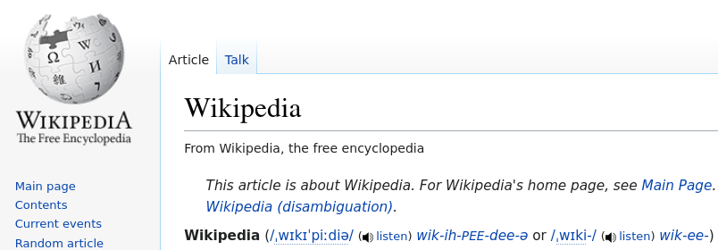
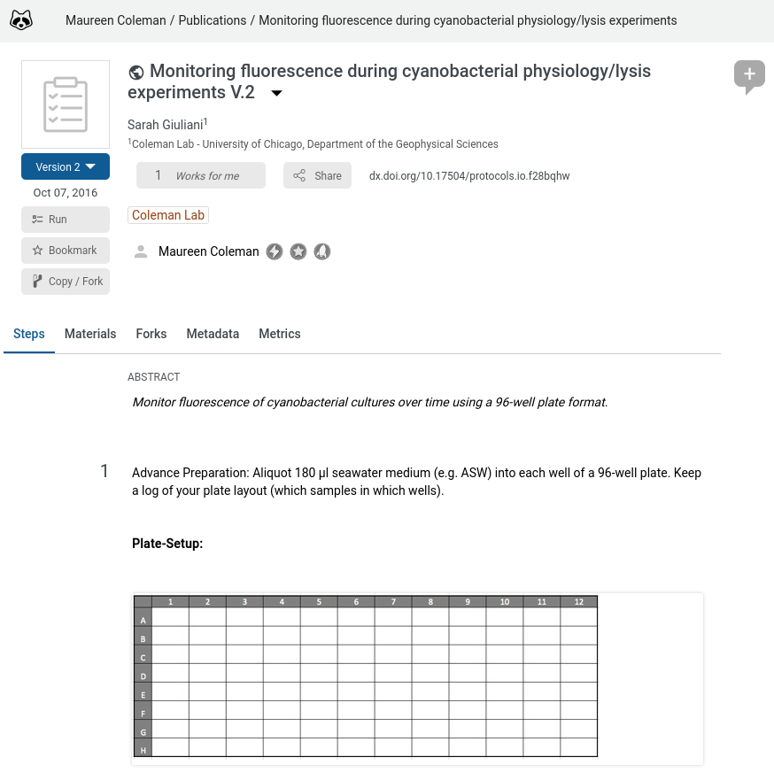
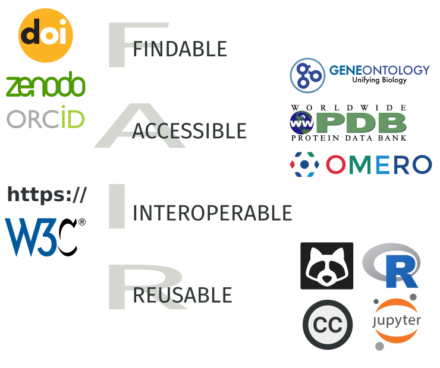

---
title: What is Open Science?
author: Guillaume Gay, CENTURI
date: June 17 2021
fontsize: 10pt
width: 800
height: 720
center: true
...

> The objective of this presentation is to give you an overview of the open science movement, convince you that it matters, and point you to resources to yourself be an open-scientist

----

# Overview

> Open science is a manifold of

- legal statuses
- organisational principles
- practices and techniques
- infrastructures
- but most importantly **communities**

----

## Early open-science  (1751 - 1780)

{ width=40% }

# Free software, open source code

## A short history of free and open source software

### GNU and the GPL

:::{.columns } :::
:::{.column width="60%"}

* From the 1950s to the '80s: software is accessory to hardware

* In the early 80s restriction on software use:

* Richard M. Stallman creates GNU on 1983
:::
:::{.column width="40%"}

:::
::::

### Linux

::::{.columns} :::
::: {.column}
* GNU focused on tools (copy and edit files, search, manage the OS)
* The core (called kernel) was missing Linus Torvalds proposed his version
:::
::: {.column}

:::
:::::

### The cathedral an the Bazaar, Eric S. Raymond

### Software licences

#### The Four Freedoms

0. The freedom to run the program for any purpose.
1. The freedom to study how the program works, and change it to make it do what you wish.
2. The freedom to redistribute and make copies so you can help your neighbour.
3. The freedom to improve the program, and release your improvements (and modified versions in general) to the public, so that the whole community benefits.

----

#### The virality debate

::: {.columns} :::::
::: {.column}
The GNU General Public Licence

* _Derivative work_ needs to uphold the same licence
* Protects the original authors
* Can hinder adoption

**copyleft**
:::
::: {.column}
MIT / BSD / MPL

* No restrictions on derivative work
* More "liberal" view
* Someone can include the user's work
with little restrictions

**permissive**
:::
::::::

# Creative commons, open data

## The notion of 'commons'

### The tragedy of the commons

[Garret Hardin](https://en.wikipedia.org/wiki/Tragedy_of_the_commons)

### Common Pool ressources

::: {.columns} :::::
::: {.column}

* Defined by Elinor Ostrom (2009 Nobel Price in economics)
* Common based peer production
:::
::: {.column}

_institution)](https://upload.wikimedia.org/wikipedia/commons/thumb/6/65/Nobel_Prize_2009-Press_Conference_KVA-30.jpg/330px-Nobel_Prize_2009-Press_Conference_KVA-30.jpg)

:::
::::::

### Creative common licences

* Public domain : 
* Attribution: 
* Attribution and Share alike: 
* Non commercial: 
* Non derivative: 

## Wikipedia

### Set of rules

## Codes of conduct, Community organisations

::: {.columns} :::::
::: {.column}

* Open source projects (as open data, and open science) are **collaborative**
* You need to be decent and respect _diversity_

[contributor-covenant.org](https://www.contributor-covenant.org/)

:::
::: {.column}

](https://upload.wikimedia.org/wikipedia/commons/thumb/a/af/Coraline_Ada_Ehmke.jpg/220px-Coraline_Ada_Ehmke.jpg)

:::
::::::

# Open Science

## Publications

### Preprints

- [ArXiv](https://arxiv.org) started in 1991
- [BioArXiv](https://bioarxiv.org) 2013
- No pre-publication peer review
- Still has to filter

### Closed access publication

](https://upload.wikimedia.org/wikipedia/commons/thumb/0/06/Aaron_Swartz_profile.jpg/220px-Aaron_Swartz_profile.jpg)

### Open access journals

::: {.columns} ::::
::: {.column}

The Public Library of Science (PLOS) was created around 2001 (Michael Eisen),
articles are published as CC-BY

:::
::: {.column}

:::
:::::::::

### Reproducible science

- Open protocols

. . .

{ width=60% }

- ReScience for software: [rescience.github.io](https://rescience.github.io/)

### Post-publication peer review

](https://scienceintegritydigest.files.wordpress.com/2021/06/screen-shot-2021-06-02-at-9.23.58-pm.png?w=485)

> There is an _edition war_ on Dr. Bik's [wikipedia entry](https://fr.wikipedia.org/wiki/Elisabeth_Bik)

## Public data ressources (aka open data)

### The PDB

::::: {.columns} :::
::: {.column}

[The protein data banck](http://www.wwpdb.org/) pioneered open data (in 1971!!)

<iframe src=https://www.ncbi.nlm.nih.gov/Structure/icn3d/full.html?&mmdbid=191590&bu=1&showanno=1&source=full-feature width=800 height=400></iframe>

:::
::: column
](https://upload.wikimedia.org/wikipedia/commons/thumb/f/fd/Berman-photo.jpg/220px-Berman-photo.jpg)

See e.g. [this video](https://www.youtube.com/watch?v=rHRSP1Qvexc) of H.M. Berman
:::
::::::

## The COVID crisis and openscience

* Need rapid access to the litterature
* Coordinated data curation efforts
* Raw data availability

## Open instruments, DIY setups

### Single instruments

* 3D printing technologies
* Lower costs, higher accessibility

::: {.columns} ::::
::: {.column}
](https://openflexure.org/assets/MicroscopeBlenderTrio.png)
:::
::: {.column}
](https://openspim.org/images/Combined_solidworks_real_registered_small_faster.gif)
:::
::::

------

#### Pumpy

](https://raw.githubusercontent.com/wiki/HenriquesLab/NanoJ-Fluidics/Files/PedroPumpsSample.png)

### Integrated setups: the Live Mouse Tracker

The [live mouse tracker](https://livemousetracker.org/) combines open
instruments, protocols and data:

{ width=80% }

## FAIR

The open science principles are summarized in the [FAIR](https://www.go-fair.org) objectives

{ width=75% }

## Conclusion

* Open Science is better science
* This is a process (both individually and collectively)
* Contributing to colaborative projects is _very_ satisfying
